+ # Awesome-3D-Generation 
  
  A curated list of recent diffusion models for 3D generation.
  
  ## Table of Contents <!-- omit in toc -->
  
  - [Websites](#toolboxes-and-foundation-models)
  - [Implicit Shape](#implicit-shape)
  - [3DGS](#3DGS)
  - [Mesh](#Mesh)
  
  ## Websites
  
  - [Hunyuan3D](https://3d.hunyuan.tencent.com/)
  
  + [Tripo AI](https://www.tripo3d.ai/)
  
  ## Implicit Shape
  
  |                           Preview                            | Title                                                        |           Publication           |                            Links                             |
  | :----------------------------------------------------------: | :----------------------------------------------------------- | :-----------------------------: | :----------------------------------------------------------: |
  |  | SparseFlex: High-Resolution and Arbitrary-Topology 3D Shape Modeling (TripoSF) |           arXiv 2025            | [Paper](https://arxiv.org/pdf/2503.21732)   [Code](https://github.com/VAST-AI-Research/TripoSF) |
  |  | Ultra3D: Efficient and High-Fidelity 3D Generation with Part Attention |           arXiv 2025            |        [Paper](https://arxiv.org/pdf/2507.17745.pdf)         |
  | 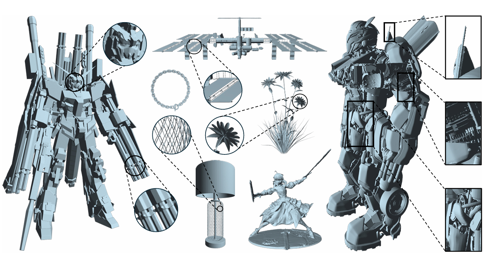 | Sparc3D: Sparse Representation and Construction for High-Resolution 3D Shapes Modeling |           arXiv 2025            |          [Paper](https://arxiv.org/pdf/2505.14521)           |
  |  | HierOctFusion: Multi-scale Octree-based 3D Shape Generation via Part-Whole-Hierarchy Message Passing |           arXiv 2024            |          [Paper](https://arxiv.org/pdf/2508.11106)           |
  |  | TRELLIS: Structured 3D Latents for Scalable and Versatile 3D Generation |            CVPR 2025            | [Paper](https://arxiv.org/pdf/2412.01506)   [Code](https://github.com/microsoft/TRELLIS) |
  |  | OctFusion: Octree-based Diffusion Models for 3D Shape Generation |            SGP 2025             | [Paper](https://arxiv.org/pdf/2408.14732)   [Code](https://github.com/octree-nn/octfusion) |
  | 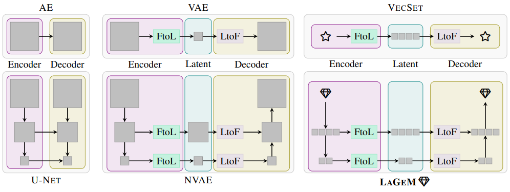 | LaGeM: A Large Geometry Model for 3D Representation Learning and Diffusion |            ICLR 2025            | [Paper](https://arxiv.org/abs/2410.01295)   [Code](https://github.com/1zb/LaGeM)   [Project](https://1zb.github.io/LaGeM/) |
  |  | XCube: Large-Scale 3D Generative Modeling using Sparse Voxel Hierarchies |            CVPR 2024            | [Paper](https://arxiv.org/pdf/2312.03806)   [Code](https://github.com/nv-tlabs/XCube) |
  |  | SplatSDF: Boosting Neural Implicit SDF via Gaussian Splatting Fusion |           arXiv 2024            |          [Paper](https://arxiv.org/pdf/2411.15468)           |
  |  | MeshFormer: High-Quality Mesh Generation with 3D-Guided Reconstruction Model |           arXiv 2024            |          [Paper](https://arxiv.org/pdf/2408.10198)           |
  | 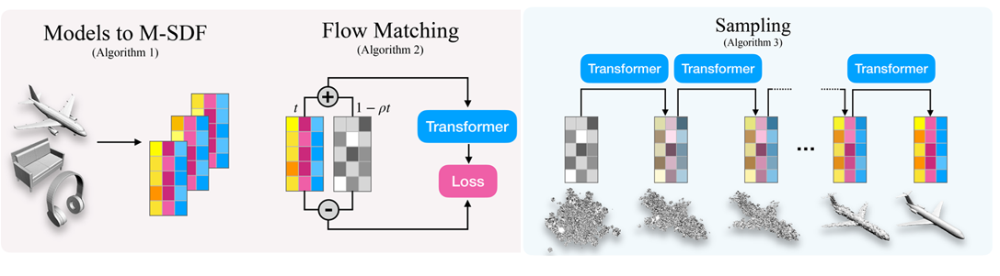 | Mosaic-SDF for 3D Generative Models                          |           arXiv 2024            |          [Paper](https://arxiv.org/pdf/2312.09222)           |
  |  | CraftsMan: High-fidelity Mesh Generation with 3D Native Generation and Interactive Geometry Refiner |           arXiv 2024            | [Paper](https://arxiv.org/pdf/2405.14979)   [Code](https://github.com/wyysf-98/CraftsMan3D) |
  |  | GSDF: 3DGS Meets SDF for Improved Neural Rendering and Reconstruction |          NeurIPS 2024           |          [Paper](https://arxiv.org/pdf/2403.16964)           |
  | 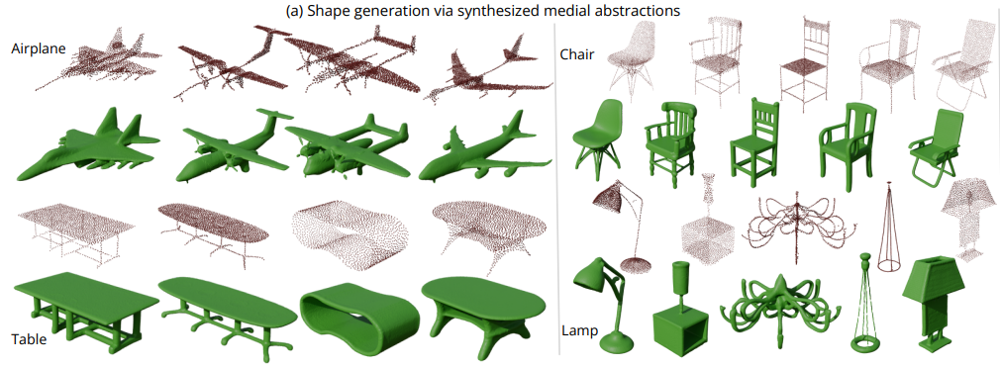 | GEM3D: GEnerative Medial Abstractions for 3D Shape Synthesis |          SIGGRAPH 2024          | [Paper](https://arxiv.org/abs/2402.16994)   [Code](https://github.com/lodurality/GEM3D_paper_code)   [Project](https://lodurality.github.io/GEM3D/) |
  |  | SurroundSDF: Implicit 3D Scene Understanding Based on Signed Distance Field |            CVPR 2024            | [Paper](https://openaccess.thecvf.com/content/CVPR2024/papers/Liu_SurroundSDF_Implicit_3D_Scene_Understanding_Based_on_Signed_Distance_Field_CVPR_2024_paper.pdf) |
  | 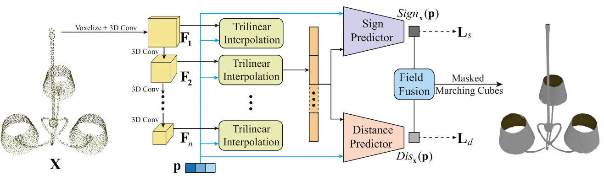 | HSDF: Hybrid Sign and Distance Field for Neural Representation of Surfaces With Arbitrary Topologies |            IEEE 2024            |   [Paper](https://ieeexplore.ieee.org/document/10636762/)    |
  |  | 3DShape2VecSet: A 3D Shape Representation for Neural Fields and Generative Diffusion Models |          ACM TOG 2023           | [Paper](https://arxiv.org/pdf/2301.11445)   [Code](https://github.com/1zb/3DShape2VecSet) |
  | 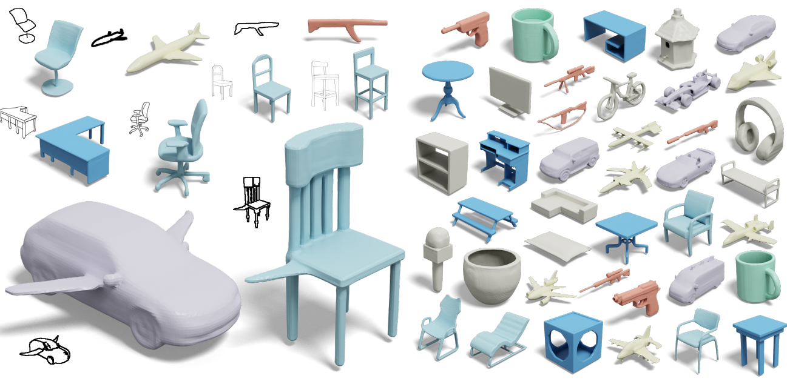 | Locally Attentional SDF Diffusion for Controllable 3D Shape Generation |          ACM TOG 2023           |          [Paper](https://arxiv.org/pdf/2305.04461)           |
  |  | Diffusion-SDF: Conditional Generative Modeling of Signed Distance Functions |            ICCV 2023            | [Paper](https://light.princeton.edu/publication/diffusion-sdf/)   [Project](https://light.princeton.edu/publication/diffusion-sdf/) |
  | 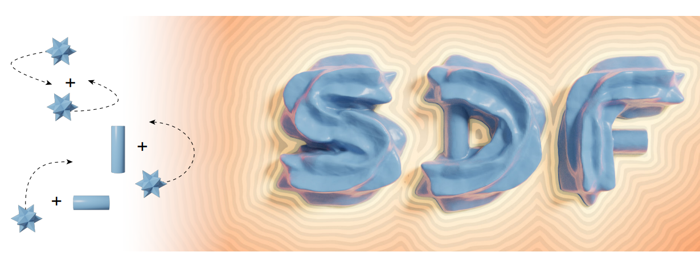 | Constructive Solid Geometry on Neural Signed Distance Fields |     ACM SIGGRAPH Asia 2023      | [Paper](https://dl.acm.org/doi/fullHtml/10.1145/3610548.3618170)   [Project](https://zoemarschner.com/research/csg_on_neural_sdfs.html) |
  |  | SDFusion: Multimodal 3D Shape Completion, Reconstruction, and Generation |            CVPR 2023            | [Paper](https://yccyenchicheng.github.io/SDFusion/)   [Code](https://github.com/yccyenchicheng/SDFusion) |
  | 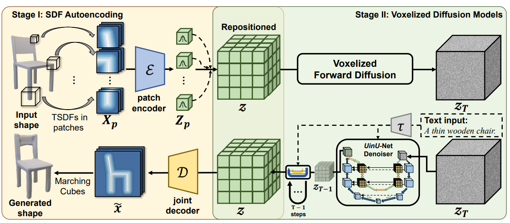 | SDF-Diffusion: Text-to-Shape via Voxelized Diffusion         |            CVPR 2023            |          [Paper](https://arxiv.org/pdf/2212.03293)           |
  |  | MeshDiffusion: Score-based Generative 3D Mesh Modeling       |            ICLR 2023            | [Paper](https://arxiv.org/pdf/2303.08133)   [Code](https://github.com/lzzcd001/MeshDiffusion) |
  |  | SDF-StyleGAN: Implicit SDF-Based StyleGAN for 3D Shape Generation |            SGP 2022             | [Paper](https://arxiv.org/pdf/2206.12055)   [Code](https://github.com/Zhengxinyang/SDF-StyleGAN) |
  |  | Neural Wavelet-domain Diffusion for 3D Shape Generation, Inversion, and Manipulation | SIGGRAPH Asia 2022   ACM TOG | [Paper](https://arxiv.org/abs/2302.00190)   [Code](https://github.com/edward1997104/Wavelet-Generation) |
  |  | AutoSDF: Shape Priors for 3D Completion, Reconstruction and Generation |            CVPR 2022            |          [Paper](https://arxiv.org/pdf/2203.09516)           |
  |  | 3DILG: Irregular Latent Grids for 3D Generative Modeling     |          NeurIPS 2022           | [Paper](https://arxiv.org/abs/2205.13914)   [Code](https://github.com/1zb/3DILG)   [Project](https://1zb.github.io/3DILG/) |
  | 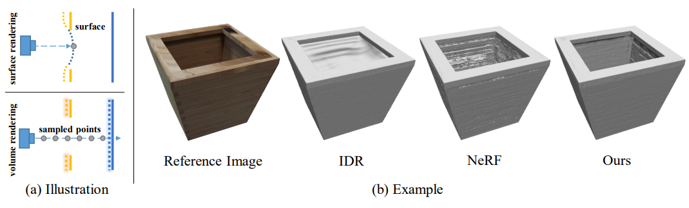 | NeuS: Learning Neural Implicit Surfaces by Volume Rendering for Multi-view Reconstruction |          NeurIPS 2021           | [Paper](https://arxiv.org/pdf/2106.10689)   [Code](https://github.com/Totoro97/NeuS) |
  |  | SIREN: Implicit Neural Representations with Periodic Activation Functions |          NeurIPS 2020           | [Paper](https://arxiv.org/pdf/2006.09661)   [Code](https://github.com/vsitzmann/siren) |
  |  | DeepSDF: Learning Continuous Signed Distance Functions for Shape Representation |            CVPR 2019            | [Paper](https://arxiv.org/pdf/1901.05103)   [Code](https://github.com/facebookresearch/DeepSDF) |
  | 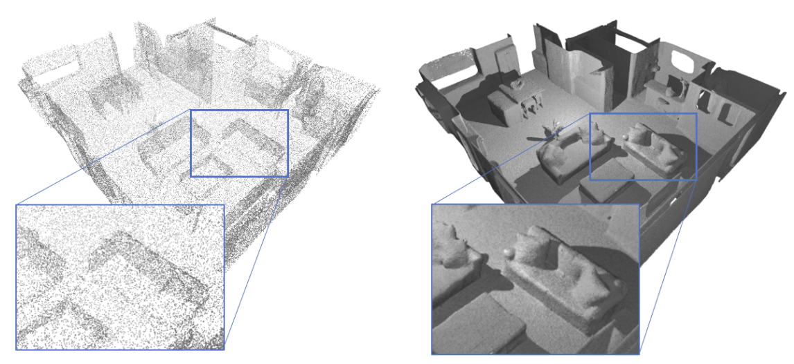 | Neural Unsigned Distance Fields for Implicit Function Learning |          NeurIPS 2020           |          [Paper](https://arxiv.org/pdf/2010.13938)           |
  |  | Convolutional Occupancy Networks                             |            ECCV 2020            | [Paper](https://arxiv.org/pdf/2003.04618)   [Code](https://github.com/autonomousvision/convolutional_occupancy_networks) |
  |  | IM-Net: Learning Implicit Fields for Generative Shape Modeling |            CVPR 2019            | [Paper](https://arxiv.org/abs/1812.02822)   [Code](https://github.com/czq142857/implicit-decoder) |
  
  ## 3DGS
  
  |                           Preview                            | Title                                                        |          Publication           |                            Links                             |
  | :----------------------------------------------------------: | :----------------------------------------------------------- | :----------------------------: | :----------------------------------------------------------: |
  |  | VRSplat: Fast and Robust Gaussian Splatting for Virtual Reality |           arXiv 2025           |          [Paper](https://arxiv.org/pdf/2505.10144)           |
  |  | Gaussian Splatting with Discretized SDF for Relightable Assets |           arXiv 2025           |          [Paper](https://arxiv.org/pdf/2507.15629)           |
  |  | Enhancing 3D Gaussian Splatting Compression via Spatial Condition-based Prediction |           arXiv 2025           |          [Paper](https://arxiv.org/pdf/2503.23337)           |
  |  | 3D Gaussian Splatting as a New Era: A Survey                 |         IEEE TVCG 2024         |   [Paper](https://ieeexplore.ieee.org/document/10521791/)    |
  |  | WildGaussians: 3D Gaussian Splatting In the Wild             |          NeurIPS 2024          |    [Paper](https://neurips.cc/virtual/2024/poster/95434)     |
  |  | Spec-Gaussian: Anisotropic View-Dependent Appearance for 3D Gaussian Splatting |          NeurIPS 2024          |      [Paper](https://nips.cc/virtual/2024/poster/93509)      |
  | 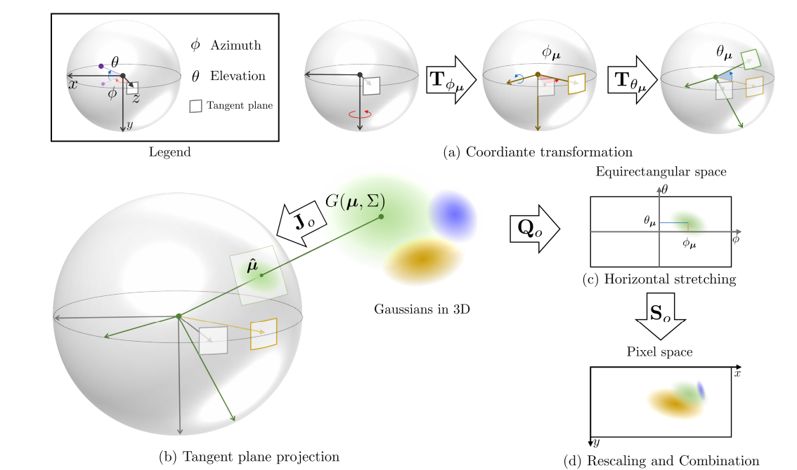 | ODGS: 3D Scene Reconstruction from Omnidirectional Images with 3D Gaussian Splattings |          NeurIPS 2024          | [Paper](https://arxiv.org/pdf/2410.20686)   [Code](https://github.com/esw0116/ODGS) |
  |  | DOGS: Distributed-Oriented Gaussian Splatting for Large-Scale 3D Reconstruction |          NeurIPS 2024          | [Paper](https://arxiv.org/pdf/2405.13943)   [Code](https://github.com/AIBluefisher/DOGS) |
  | 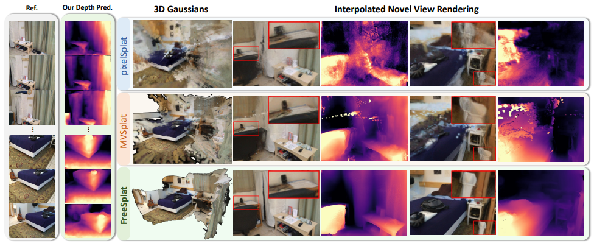 | FreeSplat: Generalizable 3D Gaussian Splatting for Free-View Synthesis |          NeurIPS 2024          | [Paper](https://arxiv.org/pdf/2405.17958)   [Code](https://github.com/wangys16/FreeSplat) |
  |  | 3D Gaussian Splatting as Markov Chain Monte Carlo            |    NeurIPS 2024 (Spotlight)    |          [Paper](https://arxiv.org/pdf/2404.09591)           |
  | 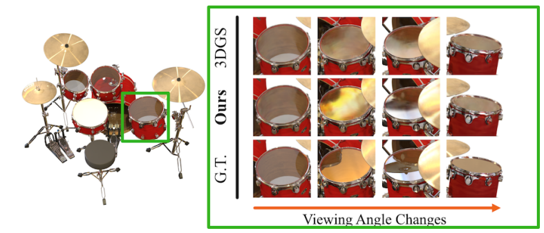 | 3iGS: Factorised Tensorial Illumination for 3D Gaussian Splatting |           ECCV 2024            |   [Paper](https://eccv.ecva.net/virtual/2024/poster/2035)    |
  | 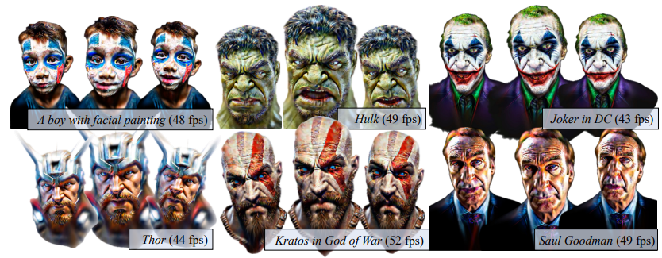 | HeadStudio: Text to Animatable Head Avatars with 3D Gaussian Splatting |           ECCV 2024            | [Paper](https://link.springer.com/chapter/10.1007/978-3-031-73411-3_9) |
  |  | Gaussian Grouping: Segment and Edit Anything in 3D Scenes    |           ECCV 2024            | [Paper](https://arxiv.org/pdf/2312.00732)   [Code](https://github.com/lkeab/gaussian-grouping) |
  |  | 2D Gaussian Splatting for Geometrically Accurate Radiance Fields |         SIGGRAPH 2024          | [Paper](https://arxiv.org/pdf/2403.17888.pdf)   [Code](https://github.com/hbb1/2d-gaussian-splatting) |
  |  | Recent Advances in 3D Gaussian Splatting                     |           arXiv 2024           |          [Paper](https://arxiv.org/pdf/2403.11134)           |
  | 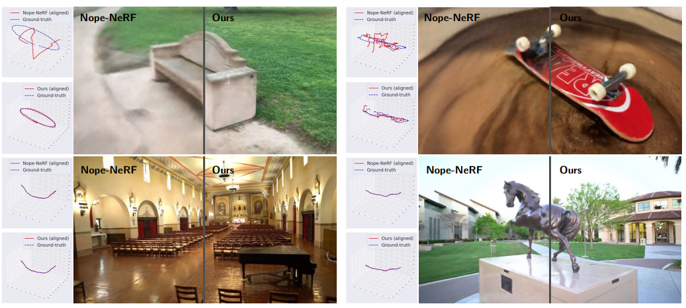 | COLMAP-Free 3D Gaussian Splatting                            |           CVPR 2024            | [Paper](https://openaccess.thecvf.com/content/CVPR2024/papers/Fu_COLMAP-Free_3D_Gaussian_Splatting_CVPR_2024_paper.pdf) |
  |  | Gaussian Splatting SLAM                                      |     CVPR 2024 (Best Demo)      | [Paper](https://openaccess.thecvf.com/content/CVPR2024/html/Matsuki_Gaussian_Splatting_SLAM_CVPR_2024_paper.html) |
  |  | Mip-Splatting: Alias-free 3D Gaussian Splatting              | CVPR 2024 (Best Student Paper) | [Paper](https://arxiv.org/pdf/2311.16493)   [Code](https://niujinshuchong.github.io/mip-splatting/) |
  |  | DreamGaussian: Generative Gaussian Splatting for Efficient 3D Content Creation |        ICLR 2024 (Oral)        | [Paper](https://arxiv.org/pdf/2309.16653.pdf)   [Code](https://github.com/dreamgaussian/dreamgaussian) |
  | 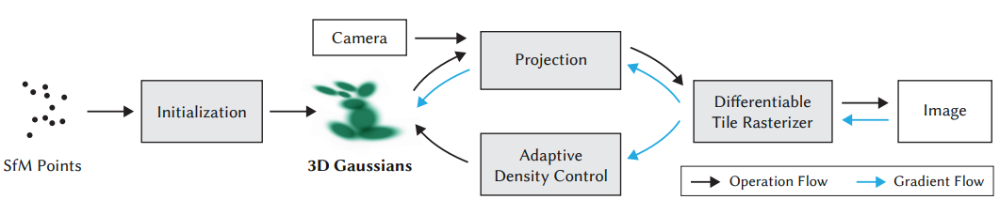 | 3D Gaussian Splatting for Real-Time Radiance Field Rendering |         SIGGRAPH 2023          | [Paper](https://arxiv.org/pdf/2308.04079.pdf)   [Code](https://github.com/graphdeco-inria/gaussian-splatting) |
  |  | A Survey on 3D Gaussian Splatting                            |           arXiv 2024           |          [Paper](https://arxiv.org/pdf/2401.03890)           |
  |  | SuGaR: Surface-Aligned Gaussian Splatting for Efficient 3D Mesh Reconstruction and High-Quality Mesh Rendering |           CVPR 2024            | [Paper](https://github.com/Anttwo/SuGaR)   [Code](https://github.com/Anttwo/SuGaR) |
  
  ## Mesh
  
  |                           Preview                            | Title                                                        |    Publication     |                            Links                             |
  | :----------------------------------------------------------: | :----------------------------------------------------------- | :----------------: | :----------------------------------------------------------: |
  | 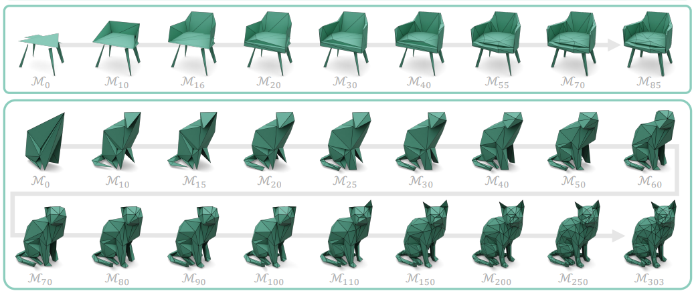 | VertexRegen: Mesh Generation with Continuous Level of Detail |     arXiv 2025     | [Paper](https://arxiv.org/pdf/2508.09062)   [Project](https://vertexregen.github.io/) |
  |  | FastMesh: Efficient Artistic Mesh Generation via Component Decoupling |     arXiv 2025     |          [Paper](https://arxiv.org/pdf/2508.19188)           |
  |  | LLaMA-Mesh: Unifying 3D Mesh Generation with Language Models |     arXiv 2024     | [Paper](https://arxiv.org/pdf/2411.09595)   [Code](https://github.com/nv-tlabs/LLaMA-Mesh)   [Demo](https://huggingface.co/spaces/Zhengyi/LLaMA-Mesh) |
  |  | FreeMesh: Boosting Mesh Generation with Coordinates Merging  |     ICML 2025      |          [Paper](https://arxiv.org/pdf/2505.13573)           |
  |  | Mesh-RFT: Enhancing Mesh Generation via Fine-grained Reinforcement Fine-Tuning |     arXiv 2025     |          [Paper](https://arxiv.org/pdf/2505.16761)           |
  | 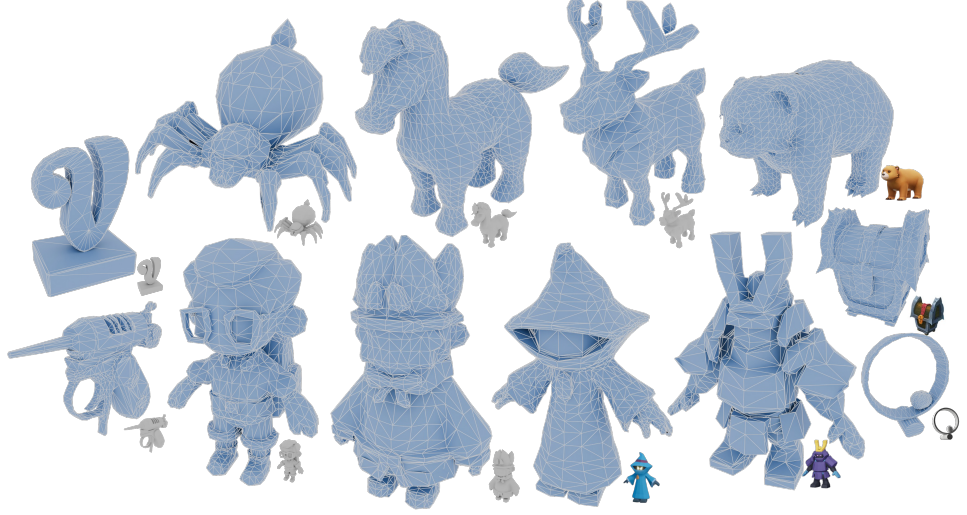 | Scaling mesh generation via compressive tokenization         |     CVPR 2025      | [Paper](https://arxiv.org/pdf/2411.07025)   [Project](https://whaohan.github.io/bpt/)   [Code](https://github.com/tencent-hunyuan/bpt) |
  |  | iFlame: Interleaving Full and Linear Attention for Efficient Mesh Generation |     arXiv 2025     | [Paper](https://arxiv.org/pdf/2503.16653)   [Code](https://github.com/hanxiaowang00/iFlame) |
  | 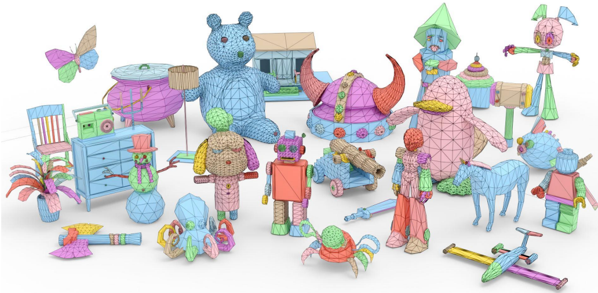 | Mesh Silksong: Auto-Regressive Mesh Generation as Weaving Silk |     arXiv 2025     |          [Paper](https://arxiv.org/pdf/2507.02477)           |
  |  | MeshPad: Interactive Sketch-Conditioned Artist-Designed Mesh Generation and Editing |     arXiv 2025     | [Paper](https://arxiv.org/pdf/2503.01425)   [Project](https://derkleineli.github.io/meshpad/) |
  | 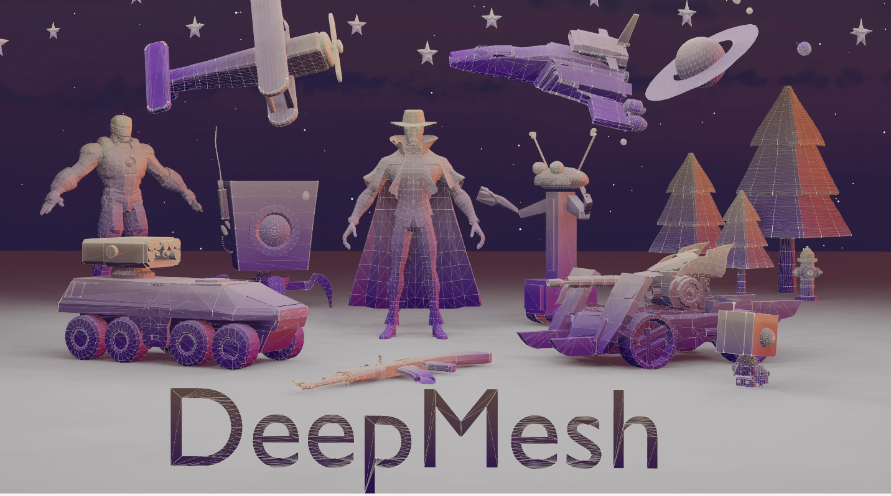 | DeepMesh: Auto-Regressive Artist-mesh Creation with Reinforcement Learning |     ICCV 2025      | [Paper](https://arxiv.org/pdf/2503.15265)   [Project](https://zhaorw02.github.io/DeepMesh/)   [Code](https://github.com/zhaorw02/DeepMesh) |
  |  | EdgeRunner: Auto-regressive Auto-encoder for Artistic Mesh Generation |     ICLR 2025      | [Paper](https://arxiv.org/pdf/2409.18114)   [Code](https://github.com/NVlabs/EdgeRunner) |
  |  | MeshArt: Generating Articulated Meshes with Structure-guided Transformers |     CVPR 2025      | [Paper](https://arxiv.org/pdf/2412.11596)   [Code](https://github.com/DaoyiG/MeshArt) |
  | 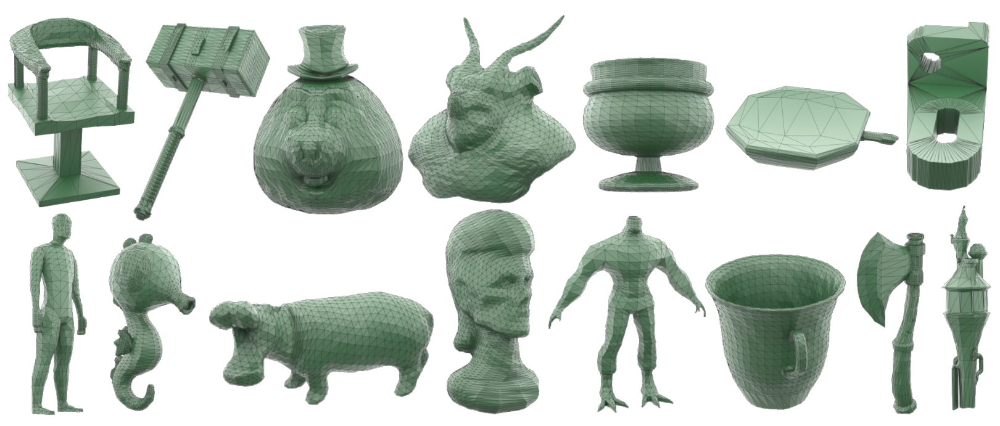 | TreeMeshGPT: Topology-Aware Mesh Generation with Tree-Structured Graph Priors |     CVPR 2025      |          [Paper](https://arxiv.org/pdf/2503.11629)           |
  | 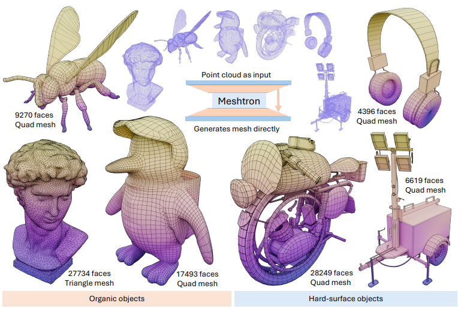 | Meshtron: High-Fidelity, Artist-Like 3D Mesh Generation at Scale |     arXiv 2024     | [Paper](https://arxiv.org/pdf/2412.09548)   [Project](https://meshtron.github.io/) |
  | 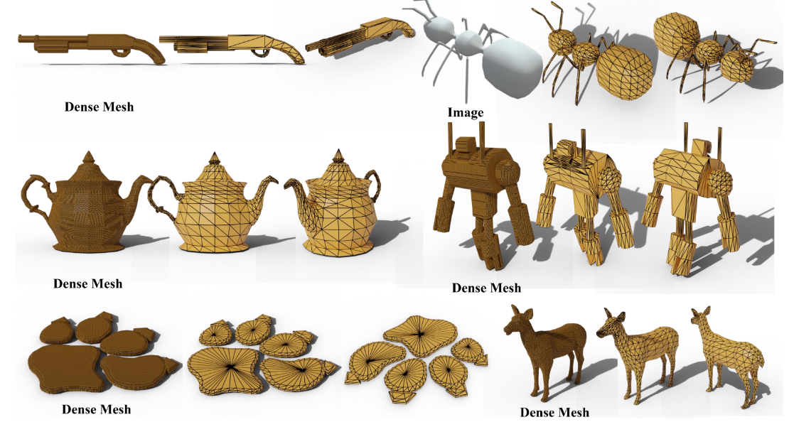 | MeshAnything V2: Artist-Created Mesh Generation With Adjacent Mesh Tokenization |     ICCV 2025      | [Paper](https://arxiv.org/pdf/2408.02555)   [Project](https://buaacyw.github.io/meshanything-v2/)   [Code](https://github.com/buaacyw/MeshAnything) |
  | 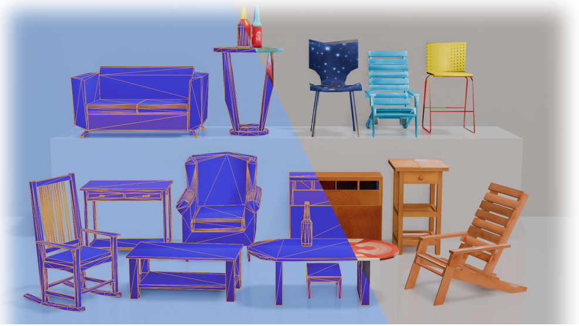 | MeshXL: Neural Coordinate Field for Generative 3D Foundation Models |    NeurIPS 2024    | [Paper](https://arxiv.org/pdf/2405.20853)   [Code](https://github.com/OpenMeshLab/MeshXL) |
  |  | SpaceMesh: A Continuous Representation for Learning Manifold Surface Meshes | SIGGRAPH Asia 2024 | [Paper](https://arxiv.org/pdf/2409.20562)   [Project](https://research.nvidia.com/labs/toronto-ai/space-mesh/) |
  |  | PivotMesh: Generic 3D Mesh Generation via Pivot Vertices Guidance |     ICLR 2025      | [Paper](https://arxiv.org/pdf/2405.16890)   [Project](https://whaohan.github.io/pivotmesh/)   [Code](https://github.com/whaohan/pivotmesh) |
  |  | MeshAnything: Artist-Created Mesh Generation with Autoregressive Transformers |     ICLR 2025      | [Paper](https://arxiv.org/pdf/2406.10163)   [Project](https://buaacyw.github.io/mesh-anything/)   [Code](https://github.com/buaacyw/MeshAnything) |
  |  | MeshGPT: Generating Triangle Meshes with Decoder-Only Transformers |     CVPR 2024      | [Paper](https://arxiv.org/pdf/2311.15475)   [Code](https://github.com/lucidrains/meshgpt-pytorch) |
  |  | PolyDiff: Generating 3D Polygonal Meshes with Diffusion Models |     arXiv 2023     |          [Paper](https://arxiv.org/pdf/2312.11417)           |
  | 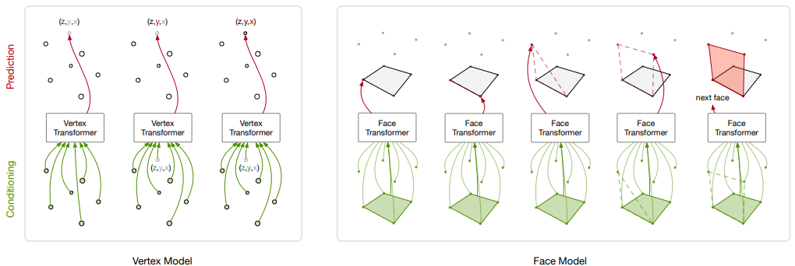 | PolyGen: An Autoregressive Generative Model of 3D Meshes     |     ICML 2020      | [Paper](https://arxiv.org/pdf/2002.10880)   [Code](https://github.com/google-deepmind/deepmind-research/tree/master/polygen) |
  
  
  ---
